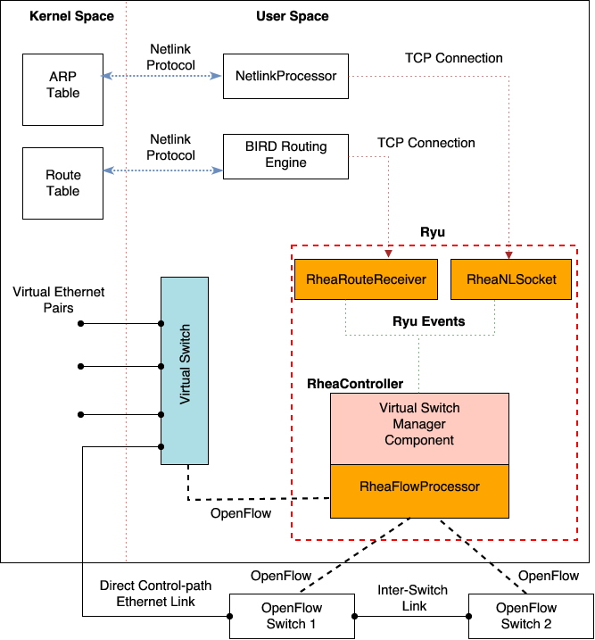

:version: 0.0.2
:copyright: 2016 `WAND <http://wand.net.nz/>`_.  All Rights Reserved.

.. meta::
   :keywords: Openflow, Ryu, RheaFlow, Routing, SDN

========
RheaFlow
========

RheaFlow is a Software Defined Networking (SDN) routing application that uses IP routing protocols to implement routing on any number of OpenFlow switches. RheaFlow multiplexes the OpenFlow switches used for routing into a single logical device on a Linux host machine, allowing any number of OpenFlow switches controlled by RheaFlow to behave like a single hardware router. This provides a network administrator with a single point of access in the network for performing debugging and configuration tasks with regular Linux tools. RheaFlow is developed as an application for the `Ryu OpenFlow Controller Platform <http://osrg.github.io/ryu/>`_.

============
Installation
============

RheaFlow can be installed with Python pip. RheaFlow requires additional Python packages such as ryu, eventlet, netaddr, PyYaml and pyroute2 for a successful installation. Pip automatically installs these dependent Python packages when RheaFlow is installed.

You have to run this as ``root`` or use ``sudo``
::
  # pip install RheaFlow
  # pip show RheaFlow

Optionally, RheaFlow can be installed by download the git repo.
You have to run this as ``root`` or use ``sudo``
::
  # git clone https://github.com/wandsdn/RheaFlow /tmp/RheaFlow
  # cd /tmp/RheaFlow
  # pip install .

Uninstall
---------

To uninstall RheaFlow.
::
  # pip uninstall RheaFlow

=============
Configuration
=============

RheaFlow is configured with a YAML-based configuration file which is located by default in ``/usr/local/etc/ryu`` directory of the Linux host machine. A sample configuration file is supplied in ``/usr/local/etc/ryu/config.yaml``. 

The configuration file consists of two block collections. The ``datapaths`` collection is used to provide information about the OpenFlow switches that will be controlled by RheaFlow. A node in the ``datapaths`` collection represents an OpenFlow switch, the entries in each node are:

  * name: human-readable name assigned to the OpenFlow switch e.g ``switch-at-x930``.
  * type: identifies the vendor of the OpenFlow switch e.g ``Allied Telesis``.
  * dp_id: Unique datapath ID of the OpenFlow switch.
  * vs_port_prefix: provides the interface name format for the virtual
                    interface siblings of the ports of the OpenFlow switch that will be used
                    for routing by the Linux host machine.
  * ports: specifies the OpenFlow port number of the interfaces on the
           OpenFlow switch that will be used for routing and the IP addresses
           that should be assigned to their virtual siblings on the Linux host machine.
  * decrement_ttl: Used to specify that TTL decrement actions should be
                   included in the OpenFlow rules installed on the switch.
  * fastpath_port: specifies the OpenFlow port number of the interface that
                   will used for FastPath on the switch.
  * fastpath_vs: specifies the OpenFlow port number of the FastPath
                 interface on the Linux host machine.
  * interswitch_links: specifies the local OpenFlow port number,
                       remote datapath ID and port number for inter-switch links on the switch.

The ``Virtual-switch`` collection is used to configure the virtual switch on the Linux host machine. ``fastpath_interface`` specifies the interface on the Linux host machine that will be used for the FastPath link to an OpenFlow switch. ``fastpath_port`` specifies OpenFlow port number that should be assigned to ``fastpath_interface``, ``fastpath_port`` should be the same as ``fastpath_vs`` provided the OpenFlow switch in the ``datapaths`` collection.

Optional
--------

Some of RheaFlow's default configuration options can be modified by editing the ``ryu.conf`` file in ``/usr/local/etc/ryu``. For example, RheaFlow can be modified to used a different configuration file by modifying ``rhea_config`` in ``ryu.conf``. The TCP port on which RheaFlow listens for connection from the OpenFlow switches can be changed by modifying ``ofp_tcp_listen_port``.

=====
Usage
=====

The Linux machine hosting RheaFlow requires Open vSwitch and BIRD Internet Routing Daemon installation. Open vSwitch allows RheaFlow to create and configure a virtual switch instance on the Linux machine that multiplexes the interfaces of the OpenFlow switches controlled by RheaFlow. BIRD provides the routing information needed to compute the Forwarding Information Base (FIB) which RheaFlow converts to OpenFlow rules that allow routing on the OpenFlow switches. The BIRD Routing Daemon is a fork that has been modified to send route information to RheaFlow in JSON format over a TCP socket. The image below shows the deployment of RheaFlow on a Linux machine.

Open vSwitch Installation
-------------------------

You have to run this as ``root`` or use ``sudo``
::
  # apt-get install openvswitch-switch

BIRD installation
-----------------

Install the following packages to compile the modified BIRD routing daemon.
::
  # apt get install gcc make build-essential m4 binutils bison flex libncurses5-dev libreadline6 libreadline6-dev automake autoconf libzmq3-dev

Download a copy of the modified BIRD router code from git and install on the Linux host machine.
::
  # git clone https://github.com/olafayomi/bird.git /tmp/bird
  # cd /tmp/bird
  # autoconf
  # ./configure
  # make
  # make install

Operation
---------

Edit the configuration file ``/usr/local/etc/ryu/config.yaml`` to provide the information required to configure the OpenFlow switches controlled by RheaFlow.

Start RheaFlow using systemd (If available) as ``root`` or use ``sudo``.
::
   # systemctl start rheaflow 

Or with RheaManager as ``root`` or use ``sudo``.
::
  # /usr/local/bin/RheaManager --start

Edit the BIRD configuration and start the BIRD daemon to provide route information to RheaFlow.
To stop RheaFlow:
::
  # systemctl stop rheaflow
Or
::
  # /usr/local/bin/RheaManager --stop
The BIRD routing daemon should be started after RheaFlow has been started otherwise it will not establish a connection with RheaFlow. Additionally, the BIRD daemon should be reloaded if RheaFlow is restarted or after RheaFlow has been stopped and started again.
 
=======================
OpenFlow switch support
=======================

RheaFlow has been tested and would work with the following OpenFlow switches for OpenFlow v1.3.

Allied Telesis
--------------

`Allied Telesis <http://www.alliedtelesis.com/sdn`
 * Allied Telesis AT 930 switch

Pica8
-----

`http://www.pica8.com/`
 * Pica 3780 (supports only IPv4).

Open vSwitch
------------

`http://www.openvswitch.org/`

=========
Licensing
=========

Please see the file called LICENSE.

=======
Support
=======

If you have any technical questions, problems or suggestions regarding RheaFlow
please create an issue on github, using `Github issues <https://github.com/wandsdn/RheaFlow/issues>`.
